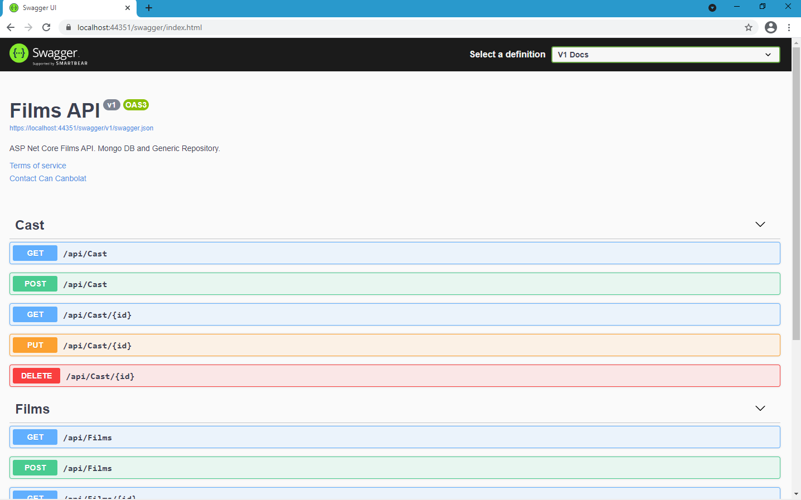

### ASP Net Core Mongo DB Web Api. Using Generic Repository

### Swagger UI


#### Database Queries
````
use FilmsApi


db.createCollection('Films')

db.Films.insertMany([
	{Title: 'The Falcon and the Winter Soldier', Year: '2021', Imdb: 8.0},
	{Title: 'WandaVision', Year: '2021', Imdb: 8.1},
	{Title: 'Attack on Titan', Year: '2013', Imdb: 8.9},
	{Title: 'Line of Duty', Year: '2012', Imdb: 8.7},
	{Title: 'The Walking Dead', Year: '2010', Imdb: 8.2},
])


db.createCollection('Cast')

db.Cast.insertMany([
	{Name: 'Gil', Surname: 'Bellows'},
	{Name: 'Clancy', Surname: 'Brown'},
	{Name: 'William', Surname: 'Sadler'},
	{Name: 'Morgan' , Surname: 'Freeman'}
])

````
